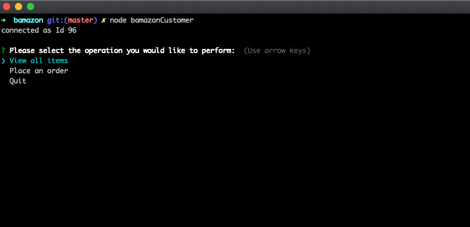

# bamazon

## Introduction

bamazon is an Amazon-like storefront node CLI App which uses MySQL to store data. It could take in orders from customers and deplete stock 
from the store's inventory, and track product sales across your store's departments and then provide a summary of the highest-grossing departments in the store.

## Instruction

bamazon App provides authorized operations based on user's role.

* Customer - `node bamazonCustomer`
    

    * `View all items from store's inventory`

    

    * `Place order`

    

    * `Quit`

* Manager - `node bamazonManager`
    

    * `View Products for Sale`
    
    
    * `View Low Inventory` 
    
    
    * `Add to Inventory`
    
    
    * `Add New Product` 
    

    * `Quit`  

* Supervisor - `node bamazonSupervisor`
    

    * `View Product Sales by Department`
    
   
    * `Create New Department`
    

    * `Quit`
